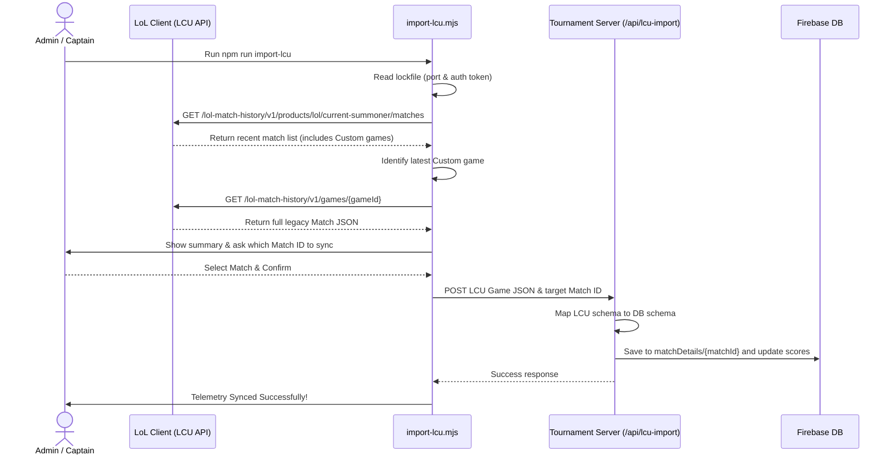

# Implementation Plan: LCU-based Custom Game Telemetry Sync

This plan details how to implement automated match telemetry imports for custom games on the VN2 server. Since Riot's public Match-V5 API restricts custom games (returning `404 Not Found`), we will use the local **League Client Update (LCU) API** to retrieve full post-game telemetry directly from a participant's League client and upload it to the tournament database.

---

## Technical Architecture: The LCU Import Flow

Although custom games do not exist on the public Match-V5 API, the local League client has access to them to show them in the player's in-game match history. The LCU API runs locally on any player's PC when the game client is open.

We will provide a local command-line tool `scripts/import-lcu.mjs` that the winning team captain or referee can run post-game to sync the match statistics.

---

## Proposed Changes

### 1. New API Endpoint: `/api/lcu-import`
We will create a new endpoint `/src/app/api/lcu-import/route.js` that:
- Receives the LCU game JSON and the target tournament match ID and game index.
- Maps the LCU legacy schema (participants details nested inside `.stats` and names inside `participantIdentities`) to the database schema.
- Updates the match scores, stages, and saves the parsed details to `matchDetails/{matchId}`.
- Recalculates standings.

#### [NEW] [route.js](file:///Users/ma108/Documents/antigravity/busy-bose/src/app/api/lcu-import/route.js)
The schema mapping logic will translate the LCU structure:
- `win`: `p.stats.win`
- `kills`: `p.stats.kills`
- `deaths`: `p.stats.deaths`
- `assists`: `p.stats.assists`
- `gold`: `p.stats.goldEarned`
- `cs`: `p.stats.totalMinionsKilled + p.stats.neutralMinionsKilled`
- `vision`: `p.stats.visionScore`
- `damageDealt`: `p.stats.totalDamageDealtToChampions`
- `damageTaken`: `p.stats.totalDamageTaken`
- `healing`: `p.stats.totalHeal`
- `tripleKills`: `p.stats.tripleKills || 0`
- `quadraKills`: `p.stats.quadraKills || 0`
- `pentaKills`: `p.stats.pentaKills || 0`
- `firstBlood`: `p.stats.firstBloodKill || p.stats.firstBloodAssist || false`
- `controlWards`: `p.stats.visionWardsBoughtInGame || 0`
- `wardsPlaced`: `p.stats.wardsPlaced || 0`
- `wardsKilled`: `p.stats.wardsKilled || 0`
- `turretsKilled`: `p.stats.turretKills || 0`
- `inhibitorsKilled`: `p.stats.inhibitorKills || 0`
- `ccDuration`: `p.stats.totalTimeCCDealt || 0`
- `items`: `[p.stats.item0, p.stats.item1, p.stats.item2, p.stats.item3, p.stats.item4, p.stats.item5]`
- `summonerName`: Match from `participantIdentities` where `participantId` matches.

---

### 2. Local Exporter Script: `scripts/import-lcu.mjs`
We will create a Node.js utility script that can be run on macOS or Windows.

#### [NEW] [import-lcu.mjs](file:///Users/ma108/Documents/antigravity/busy-bose/scripts/import-lcu.mjs)
- Automatically search for the `lockfile` at:
  - macOS: `~/Library/Application Support/Riot Games/League of Legends/lockfile`
  - Windows: `C:\Riot Games\League of Legends\lockfile`
- Parse the port and password.
- Disable TLS validation (to connect to League client's self-signed HTTPS certificate).
- Fetch the match list and retrieve the detailed stats of the latest custom game.
- Ask the user which scheduled match ID from the portal to link the game to.
- POST the telemetry to the backend API (`/api/lcu-import`).

---

### 3. Add Script Shortcut to `package.json`
#### [MODIFY] [package.json](file:///Users/ma108/Documents/antigravity/busy-bose/package.json)
Add a script definition `"import-lcu": "node scripts/import-lcu.mjs"` to make running the importer simple.

---

### 4. Admin UI Details
We will keep the **Manual Score Entry** in the Admin panel as a fallback, so the referee can always manually force-complete a game if someone is unable to run the LCU exporter script.

---

## Verification Plan

### Automated Tests
- Run `npm run build` to ensure the project compiles successfully.

### Manual Verification
1. Run League of Legends on your PC and play a custom lobby match (or play a custom game against bots).
2. Start the development server with `npm run dev`.
3. In a terminal, run `npm run import-lcu`.
4. Check that the script correctly locates the `lockfile`, connects to the client, fetches your custom match details, and successfully uploads them to `http://localhost:3000/api/lcu-import`.
5. Open the tournament dashboard, check the schedule page, click **Inspect Match Stats**, and verify that the stats modal displays the complete player stats.
